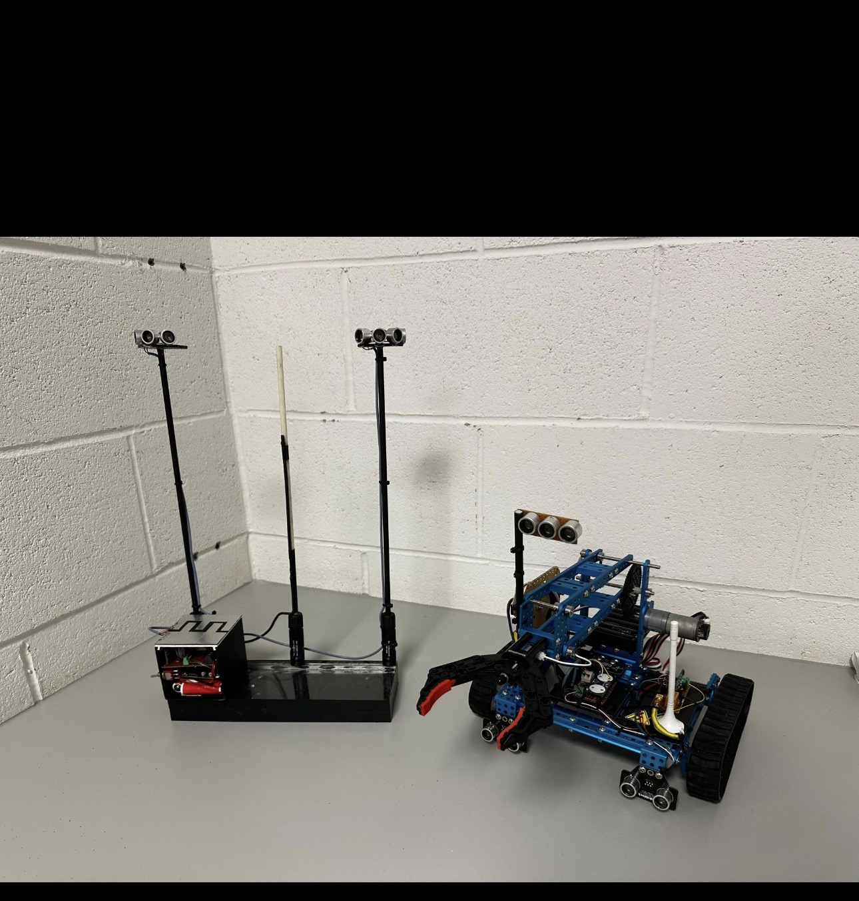
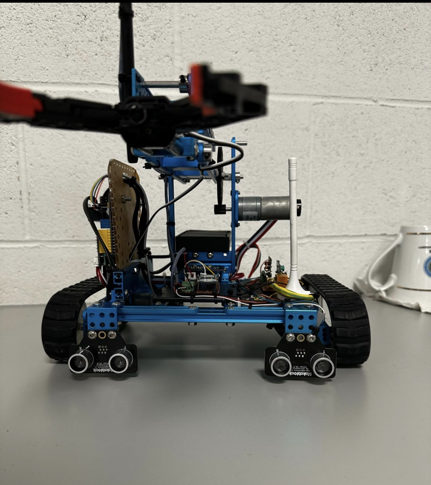
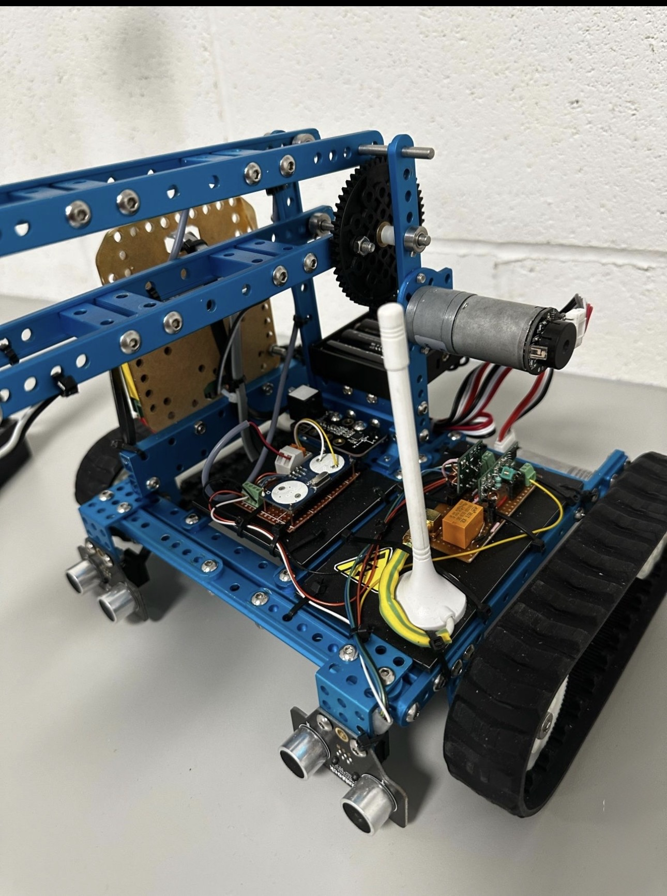
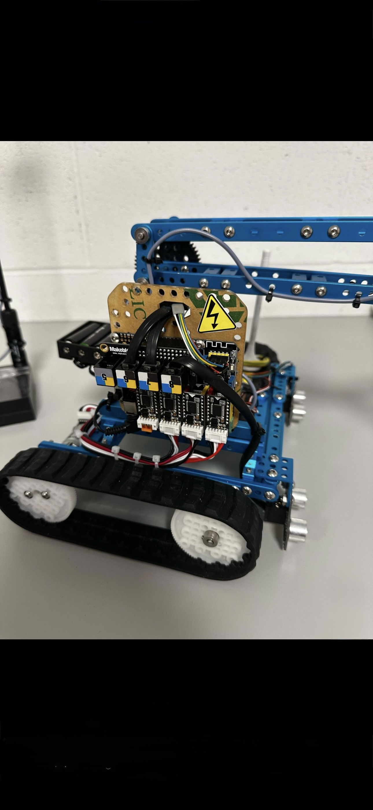

# Robotic Waste-Sorting System

A university team project at Maynooth University exploring automated waste collection and sorting using the Makeblock Ultimate 2.0 kit, sensors and C++ control logic.

## Project overview

Our team developed a robot to detect waste objects, collect them with a gripper, classify them as metal or plastic, and deposit them in the appropriate bins. The project brought together mechanical assembly, electronics, sensor-based navigation and software control.

## My contribution

I was the team lead, coordinating the work from concept development through to final testing. My responsibilities included:

- Coordinating tasks and helping the team integrate the different parts of the system.
- Contributing to hardware integration and software programming.
- Working with teammates on sensor-based navigation, C++ control logic and closed-loop feedback for object detection and sorting.
- Leading the drafting and review of the technical report to document our approach, findings and challenges.

The complete system was a collaborative team effort; this page describes both our shared outcome and my individual contribution.

## Tools and components

- Makeblock Ultimate 2.0 robotics kit
- C++ control programming
- Ultrasonic distance sensors
- Tracked mobile platform
- Motor-driven arm and gripper
- Integrated control electronics and sensor wiring

## How it works

1. Read sensor information to detect objects and support navigation.
2. Position the robot and use the arm and gripper to collect an object.
3. Classify the object as metal or plastic.
4. Move to the appropriate bin and release the object.

Sensor feedback supports the robot's control decisions throughout the process.

## Outcome and lessons

Our team completed a working waste-sorting prototype. Bringing the hardware and software together required repeated testing and coordination, particularly when integrating the sensors, movement and collection mechanism.

The project gave me practical experience in hardware/software integration, C++ control logic, technical documentation and leading a team through an engineering build.

No numerical sorting-accuracy or reliability benchmark is presented here.

## Build gallery

### Front view and distance sensors

### Arm mechanism and electronics

### Controller and wiring

## Repository status

This repository currently contains project documentation and photographs. The original source code, wiring diagrams and executable setup instructions are not included, so it is a project showcase rather than a reproducible build package.

## Author

**Harold Chukwurah** — Team Lead

[LinkedIn](https://ie.linkedin.com/in/harold-chukwurah-a616b534b) · [GitHub](https://github.com/haroldchukwurah16-blip)
